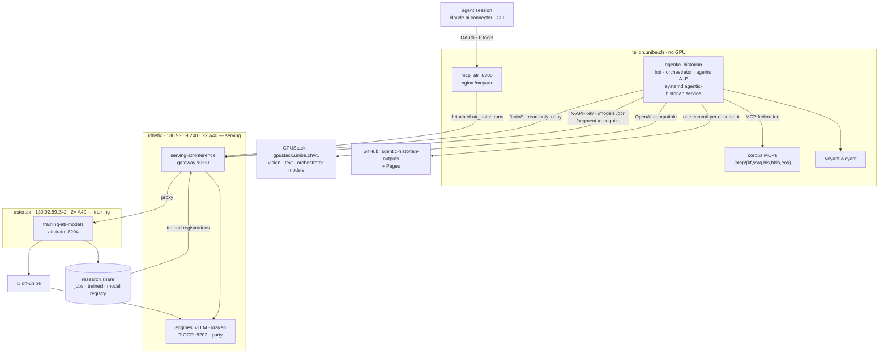

# Agentic Historian

An agentic pipeline for working with handwritten historical sources — Swiss and
German administrative material, 14th to 19th century. It reads a scan, describes
the source in codicological terms, extracts and links the persons and places it
names, and publishes the result as a reviewable diff on a public site.

It **runs no models of its own.** Recognition happens on a serving box, training
on a second one, general-purpose LLM work on the institute's GPUStack. This
repository is the historian-facing side: the agents, the orchestration, the
human-in-the-loop gates, the interface, and the clients that talk to those
services. What that separation costs and buys is the subject of half this file.

Detailed module documentation lives in
[`agentic_historian/README.md`](agentic_historian/README.md); operational
runbooks in [`docs/`](docs).

---

## How it was conceived

**Agents are roles, not a hierarchy.** The work a historian does with an unknown
scan decomposes into things that can be asked separately: read it (A), describe
it (B), identify who and where it names (C), situate it in a corpus (D), account
for what it cost (E). Each is a module under `agentic_historian/agents/`, each is
callable on its own, and `agent_tools.py` exposes all of them under one registry
so a planner — or a person — can pick. `orchestrator.py` is wiring, not
intelligence; the LLM planner (`nl_orchestrator.py`) is an overlay that can be
switched off.

**The interface is a chat the seminar already uses.** `bot.py` is a Discord bot
and deliberately a thin shell: every command is a few lines over a core module
that has no idea Discord exists (`ingest.py`, `orchestrator.py`, `atr_batch.py`).
That is what makes the same operations reachable from a cron job, a CLI
(`python -m agentic_historian`) and an MCP server without a second
implementation.

**Two passes, because the first one cannot know what it is reading.** Model
selection needs a language, a script and a century; a scan arrives with none of
them. So pass 1 reads blind, Agent B describes the source along the Ad-Fontes
16-element framework, and pass 2 reads it again with the models that description
implies. A declared language is kept as a *set* — a cartulary with German front
matter and Latin charters is both, and the page is only the unit the pipeline
happens to have, not a claim that a page has one language.

**The human is a gate, not a reviewer at the end.** Gate 1 corrects inferred
metadata and re-routes recognition; Gate 2 asks which of several readings is
closest; `runstate.py` invalidates exactly the stages a decision affects, so a
correction re-runs what it changed and nothing else.

**No ground truth is claimed anywhere.** When engines disagree badly the
candidates are selected, not merged — a vote over genuinely different readings
returns noise. A Gate-2 choice is the closest available reading, bounded by the
pool we produced, so the preference log stores *comparisons* (`chosen ≻ offered`)
and never transcription text. Everything measured from it — coverage, selection
agreement, `regret_cer`, Bradley–Terry engine strength — is a statement about our
own selector and our own pool, and a bucket below ~10 comparisons reports
*insufficient data* rather than a confident-looking number. The reasoning is in
[*Quality without ground truth*](agentic_historian/README.md#quality-without-ground-truth).

**Publishing is a commit.** Every processed document goes to
[thodel/agentic-historian-outputs](https://github.com/thodel/agentic-historian-outputs)
as one atomic commit — transcription, description, entities, `pipeline.json`,
rendered page — so a re-run is a diff a historian can read. Text only; images are
linked, never committed.

---

## The machines



Everything on this diagram is inside the university network: GPUStack is
IP-gated and the ATR gateway is reachable from tei only, so live runs need the
unibe VPN.

---

## Talking to the serving service

[`serving-atr-inference`](https://github.com/thodel/serving-atr-inference) runs
every recognition engine behind one FastAPI gateway on idhefix `:8200`. This repo
is a client of it and nothing more:

- **One client, one key.** `agent_a/kraken_client.py` speaks `GET /health`,
  `GET /models`, `POST /segment`, `/recognize`, `/ocr`, authenticated with a
  static `X-API-Key` (`ATR_GATEWAY_URL`, `ATR_API_KEY`).
- **The registry is theirs.** `config/models.yaml` in the serving repo is
  authoritative. At startup `refresh_kraken_registry()` fetches the live `/models`
  so `agent_a/model_selector.py` routes language/script/century against what is
  actually served; the table in `agent_a/models.py` is only a fallback for an
  unreachable gateway. Registering a model there is enough — no change here.
- **Timeouts must respect the other side's budget.** `ATR_HTTP_TIMEOUT` defaults
  to 300 s because the gateway's own engine budget is 300 s. A tighter client
  timeout records a phantom failure for an engine that was still working; that is
  exactly what happened to `trocr-medieval-escriptmask` on 2026-07-16.
- **Page-level and line-level are different contracts.** VLM, kraken and party
  take a page; the TrOCR models need pre-segmented line images, so a page goes
  through `blla` segmentation first. The ensemble
  (`agent_a/ensemble.py`, `dual_pipeline.py`) hides the difference from the
  agents but not from the report.
- **Batch runs iterate model-major.** `atr_batch.py` reads every page with one
  model before moving to the next, because the gateway's VLMs are
  `residency: lazy` on a single card: page-major would pay an evict-and-reload
  cycle per page. The run is resumable — the output on disk *is* the state — and
  it classifies failures rather than catching them (a 404 abandons that model, a
  timeout is retried, a bad page is stepped over). Runbook:
  [`docs/BATCH_ATR.md`](docs/BATCH_ATR.md).
- **No ranking comes out of it.** A batch answers "how do these models read this
  collection", not "which is best" — there is no reference text in a run like
  that.

## Talking to the training service

Training moved to [`training-atr-models`](https://github.com/thodel/training-atr-models)
on asteraix on 16.09.2026. **This repository trains nothing.** It requests,
watches and reports — and it does so through the *same* gateway on idhefix, which
proxies `/train/*` to the trainer on `:8204`. There is no second host, no second
port and no firewall exception on this path.

- **Typed client.** `agent_a/training_client.py` mirrors the recognition client:
  `POST /train/jobs`, `GET /train/jobs[/{id}]`, `/cancel`, `/log?stage=…`, same
  key, same lifecycle, job states `queued → preparing → compiling → training →
  testing → registering → done|failed|cancelled`.
- **Today's bot surface is read-only.** `/atr_jobs`, `/atr_job`, `/atr_gpu`,
  `/atr_progress` (`atr_status.py`) report both machines and label them for what
  they are: `GET /gpu` is idhefix's cards — the ones recognition runs on — and
  `GET /train/gpu` is asteraix's, with jobs attributed. Cancelling a job or
  killing a process from a chat box deserves its own confirm flow and its own
  decision about who may, so it is not here yet.
- **Events, not questions.** `atr_watch.py` announces a run that failed and GPU
  memory nothing accounts for, once each, because the cases that motivated it
  were found late by hand: an 11 h run that died unnoticed, and a data-loader
  worker holding 27,530 MiB for sixteen hours while both cards read 0 % utilisation.
  It is silent on first sight after a restart, so a deploy never pastes the job
  history into a channel.
- **Starting runs is designed, not shipped.** Presets rather than raw
  hyperparameters, admin-gated with a cost confirmation, fire-and-forget plus
  polling with a persisted watch registry — a six-hour job cannot sit in the bot's
  single FIFO queue or survive inside Discord's 15-minute interaction window. The
  design and its milestones are in
  [`docs/TRAINING_INTEGRATION_PLAN.md`](docs/TRAINING_INTEGRATION_PLAN.md).
- **The loop closes through the registry, not through this repo.** A finished run
  registers on the shared research share; the serving gateway picks the
  registration up and advertises the model at `/models`; the next
  `refresh_kraken_registry()` makes it selectable here. A model trained on
  Monday is routable on Tuesday without a commit in this repository.
- **Two CER numbers that must not be confused.** `ketos test` CER (line crops
  from ground-truth segmentation) and eval-harness CER (a full page through our
  own segmentation) measure different things and will disagree. Any report that
  carries a number must say which, against which reference, under which
  normalisation.

## The other services

- **GPUStack** (`gpustack.unibe.ch/v1`, OpenAI-compatible) serves the
  general-purpose models by role: vision `qwen3.8-27b` for Agents A/B, text
  `gpt-oss-120b` for C/D/E, `minimax-m2.7` reserved for orchestration. Routing is
  in `config.py`; `gpt-oss-120b` is a reasoning model, so text calls need a
  generous `max_tokens` floor. No Claude, no Gemini — everything stays in-house.
- **MCP federation** on tei (`/mcp/kf`, `/mcp/ssrq`, `/mcp/hls`, `/mcp/hbls`,
  `/mcp/eos`) supplies authority data for Agent C's entity linking, queried in
  parallel and merged by `utils/entity_resolver.py`. The registry is declarative
  (`knowledge_hub/mcp_registry.py`); a new source is a reviewed PR, never a
  hot-load.
- **`mcp_atr/`** is the inverse direction: a small MCP server on tei that lets an
  agent session *drive* this stack — mirror a share, start a batch, poll it, read
  what it produced. It exists because a cloud session cannot open a socket to tei
  at all, while MCP is dialled by the broker over 443. It is a door of exactly
  eight tools, never a shell: a caller chooses which corpus and which models and
  can never choose a command, a flag or a path outside the corpus roots.
  ([`deploy/mcp-atr/`](deploy/mcp-atr), [`docs/CLAUDE_CODE_CONNECTIVITY.md`](docs/CLAUDE_CODE_CONNECTIVITY.md))
- **Voyant** at `tei.dh.unibe.ch/voyant/` backs Agent D's corpus views.
- **Nextcloud / SwitchDrive** shares are the ingestion side: a folder of scans is
  mirrored, or read straight over WebDAV with a page cache in front of it.

---

## Layout

| path | |
|---|---|
| `agentic_historian/` | the package — agents, orchestrator, gates, clients, bot, MCP server ([its README](agentic_historian/README.md) documents every module) |
| `docs/` | runbooks and plans: batch ATR, training integration, evaluation harness, connectivity, Nextcloud, lessons |
| `deploy/` | systemd units and nginx config for the pieces that run on tei |
| `workspace/` | environment templates and scratch material |

## Running it

Python 3.11 or 3.12, on the unibe VPN. From the repository root:

```bash
python3.12 -m venv .venv
.venv/bin/python -m pip install -r requirements-dev.txt
.venv/bin/python -m pip install -e agentic_historian --no-deps --no-build-isolation
.venv/bin/python -m ruff check agentic_historian
.venv/bin/python -m pytest agentic_historian/tests
```

The suite is offline: GPUStack, the ATR gateway, MCP, WebDAV, Voyant, Discord and
GitHub are mocked at their boundaries, and CI runs it on every PR. Configuration
is a single `.env.gpustack` at the repository root (gitignored; template in
`workspace/gpustack.env.example`) — every variable is listed in
[`agentic_historian/README.md`](agentic_historian/README.md#environment-variables-envgpustack-repo-root).
In production the bot runs on tei under `agentic-historian.service`.

Contribution rules — one issue, one branch off `origin/main`, one PR, never
stacked — are in
[`agentic_historian/README.md`](agentic_historian/README.md#contributing--pr--issue-rules),
and they are there because each of them has been violated at least once.
